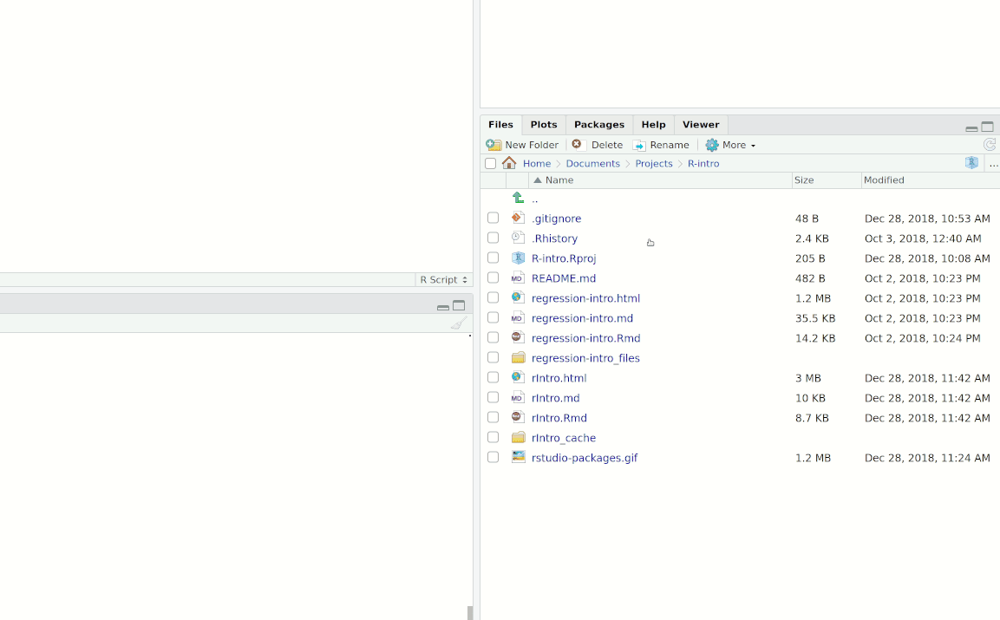

```{r setup, include=FALSE}
knitr::opts_chunk$set(echo = T, warning = F, message = F, cache = T)
```

## Installation

Having R and R Studio on your laptop will allow you to work on problem sets and explore the magnificent functionality of R outside the lab. R is the language and R Studio helps us interact with R. It is important that you **install R before you install R Studio.**

### Install R

In your web browser, 

- Go to [r-project.org](https://www.r-project.org) 

- Click [download R](https://cran.r-project.org/mirrors.html). 

- At this point, you'll be directed to a page with a list of institutions that host the Comprehensive R Archive Network (CRAN). The idea is to pick an institution near you. Scroll down to USA and click the link for [OSU](https://ftp.osuosl.org/pub/cran/). 

**Windows Instructions:** If you have a Windows machine, 

- Click `Download R for Windows` 

- Click `install R for the first time`

- Click `Download R 4.1.2 for Windows`

- To complete installation, run the `.exe` file you downloaded.

**Mac Instructions:** If you have a Mac, 

- Click `Download R for (Mac) OS X`

- Under "latest release", click `R-4.1.2.pkg` if your mac has **Intel chip**

- Click `R-4.1.2-arm64.pkg` if your mac has **Apple silicon chip** 

- To complete installation, run the `.pkg` file you downloaded.

**Make sure you download different package depending on the type of chip your Mac has.**

**Linux Instructions:** If you run a Linux distro, note that installation instructions vary by distro. That said, you probably know what you're doing.


### Install RStudio


In your web browser, go to [rstudio.com/products/rstudio/](https://rstudio.com/products/rstudio/), scroll down to R Studio Desktop, and then click [Download RStudio Desktop](https://rstudio.com/products/rstudio/download/) under "Open Source Edition." Scroll down to "Installers for Supported Platforms" and click the link that corresponds with your operating system. To complete installation, run the installer you downloaded.

## R Basics

### Mechanism that runs RStudio

RStudio is an integrated development environment (IDE) for R. In other words, RStudio is an environment that provides a set of necessary tools for programmers to easily write and execute codes. Because RStudio is just an environment, it won't run any codes if R is not installed prior to installation of RStudio. Note that technically, all the codes written in scripts run on R, and not RStudio. 


### Using the console

When you open R Studio for the first time, you should notice three panels. The large panel to the left is the **console**. This is where you run code that tells R what to do. You can also use the console as a calculator. For example, if you type `5+5*2-1` in the console and hit `Enter`, then R will return
```{r, echo = FALSE}
5+5*2-1
```
in the console. 

### Everything is an object

The upper-right panel is the **global environment**. This is where R Studio stores datasets, user-defined functions, and other **objects**. 

To define an object, you use the **assignment operator** `<-` or simply `=`.[^assignment] For example, suppose that you want to assign the number 5 to an object called `a`. In the console, you would type
```{r}
a <- 5
```
which reads "`a` gets 5." When you execute this code (by hitting `Enter`), `a` will show up in the global environment. Hovering your cursor over `a` in the global environment tells you that `a` is a numeric object.

[^assignment]: **Pro tip:** You can type the assignment operator with the keyboard shortcut `Alt` `-`.

There are other kinds of objects, too. For example,
```{r}
b <- "I Love Metrics"
```
is a character object, and 
```{r}
mat <- matrix(c(1, 2, 3, 4),
              nrow = 2)
```
is a matrix.


### Packages

R functions come in packages. When you open a fresh R session in RStudio, a number of packages come pre-loaded. These include packages with common math and statistics functions and are known collectively as "base R." Base R is wonderful, but non-default packages offer a great deal of flexibility and functionality. 

You could consider a package to be a combined set of multiple packages, or multiple data sets and functions defined by other coders in the R community. For example, one common package that we will use often later in the class is [`tidyverse`](https://www.tidyverse.org/packages/) package. In this package, multiple functions that are useful for data analysis are predefined so that we could simply call a specific function name to use it. 

**Install a package:** `install.packages("package.name.here")`

- Replace `package.name.here` with the name of the package you want to install.
- Make sure the name of the package is in quotes.
- You only have to install a package once.

Alternatively, you can click on the `Packages` tab of the bottom-right panel:



**Load a package:** `library(package.name.here)`

- To use functions from a non-base package, you need to load the package at the beginning of each new R session.
- Quotes around the package name are no longer needed.

#### **`pacman`**

We will often need to load several packages in a single session. One way to do this is to execute `library(package.1)`, then `library(package.2)`, then `library(package.3)`, and so forth. A less cumbersome way to load multiple packages is to use the `p_load` function from the `pacman` package. 

- Use the instructions above to **install `pacman`**.
- Load the `pacman` package with `library(pacman)`.
- When you want to load additional packages, you can then execute `p_load(package.1, package.2, package.3)`.
- **Added bonus:** `p_load` first checks to see if the packages are installed. If they aren't, then it will install them for you.

### R scripts

To produce reproducible[^reproducible] R code, it is best to use scripts. Open a new R script file with the `.R` extension by clicking `File` then `New File` then `R Script`. We will write our first script to generate a histogram and scatter plot using `ggplot2`.

[^reproducible]: Reproducible = fewer headaches later.

### `ggplot2`

Start by writing code to install and load `ggplot2`.

```{r}
library(pacman)
p_load(ggplot2)
```

- To learn more about the package or the function of your using, simply put `?` in front of the name of the package/function with no space in between the question mark and the name of the package/function.  
- To execute *one line of your script*, click the line you want to run and then click `Run` at the upper-right corner of your R script. A quicker alternative is to click the line you want to run and then use the keyboard shortcut `Ctrl` `Enter`. 
- To execute *the entire script*, click `Source` at the upper-right corner of your R script or use the keyboard shortcut `Ctrl` `Alt` `R`. You could adjust these hot keys per your taste by selecting `Tools`>`Modify Keyboard Shortcuts...`. 

**Aside:** It is useful to leave comments in your code to explain to your future self what your code is doing and why. You can leave a comment by typing a hash `#`:

```{r}
# This is a comment. R will ignore it.
```

Check out the example dataset `midwest` from `ggplot2`. You can view the first few rows of the dataset with variable names by using the `head` function.

```{r}
head(midwest)
```

Next, make a histogram of county poverty rates (measured by the variable `percbelowpoverty`) using the `ggplot` function. You will need to tell `ggplot` 

- The name of the dataset.
- The name of the variable.
- The type of graph (in this case, `geom_histogram()`).

```{r}
ggplot(data = midwest, aes(x = percbelowpoverty)) + 
  geom_histogram()
```

To visualize relationships between variables, you can make a scatter plot. Do poverty rates appear positively or negatively correlated with race, as measured by the variable `percblack`?

```{r}
ggplot(data = midwest, aes(x = percblack, y = percbelowpoverty)) + 
  geom_point()
```

## Exercises

Fill in the chunk below. 

```r
# Create an object called `name` with your name as value.
# Create an object called `a` and assign value 1.
# Create an object called `b` and assign value 2.
# Return a + b
# Return a - b
# Return a*b
# return a/b
# Install `tidyverse` package.
# Load `tidyverse` package.
```

Submit the knitted html document on Canvas. You could click `File`>`Knit Document` or simply use shortcut, `Ctrl` `Shift` `K` to knit the Rmarkdown or R scripts. You may able to see the knitted document in the same folder that this .Rmd file is located (If you've downloaded the file directly from Canvas, the .Rmd may be located in `Downloads` folder by default and thus you may want to look for the knitted document there).
