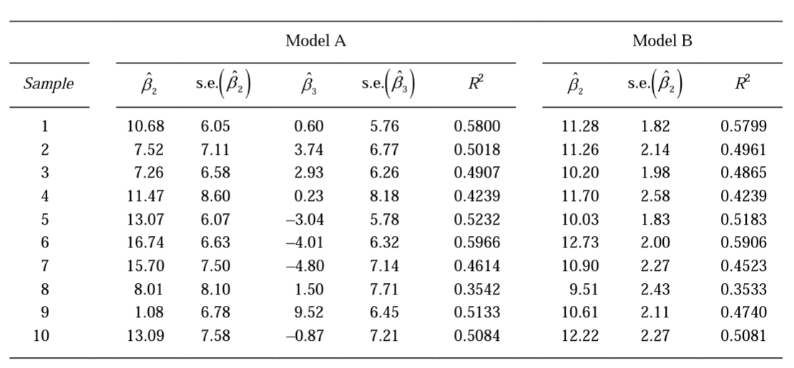
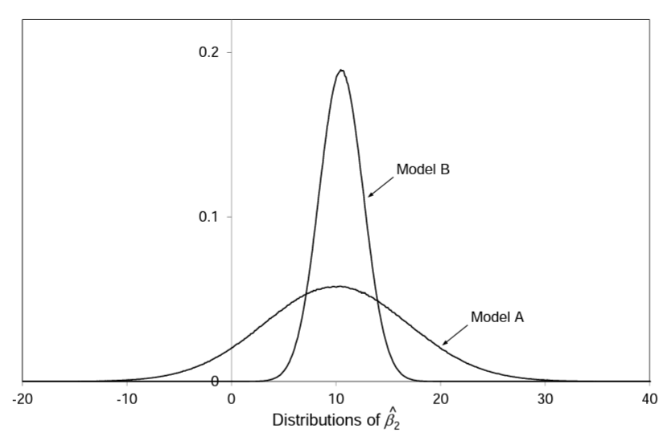

# 1. (Textbook Question 6.6) 10 points

In a Monte Carlo experiment, a variable $Y$ is generated as a linear function of two variables $X_2$ and $X_3$; 
$$
Y = 10.0 + 10.0 X_2 + 0.5X_3 + u
$$
\noindent where $X_2$ is the sequence of integers $1,2, \cdots, 30$, $X_3$ is generated from $X_2$ by adding random numbers, and $u$ is a disturbance term with a normal distribution with mean zero and variance $10,000$. The correlation between $X_2$ and $X_3$ is 0.95. The table shows the result of fitting the following regressions for 10 samples:

$$
\begin{aligned}
  \text{Model A}: \hat{Y} &= \hat{\beta}_1 + \hat{\beta}_2X_2 + \hat{\beta}_3X_3 \\
  \text{Model B}: \hat{Y} &= \hat{\beta}_1 + \hat{\beta}_2X_2 
\end{aligned}
$$


The figure shows the distributions of $\hat{\beta}_2$ for the two models for 10 million samples. In the case of Model A, the distribution of $\hat{\beta}_2$ has mean 10.001 and standard deviation 6.910. For Model B, the mean is 10.500 and the standard deviation is 2.109. Comment on all aspects of the regression results, giving full explanations of what you observe.

```{r pressure, echo=FALSE, out.width = '100%'}


```


\newpage
# 2. (Textbook Question 6.8) 10 points
```{r include=F}
library(pacman)
p_load(tidyverse, readr, broom)
wages=read_csv("/Users/boyoonc/Downloads/EAWE22.csv")
wages$LGEARNINGS=log(wages$EARNINGS)
```
Following is the results of regressing $LGEARN$ on $S$, $EXP$, $ASVABC$, $MALE$, $ETHBLACK$, $ETHHISP$. Now we repeat the regression adding $AGE$. 
($LGEARN$ denotes the logged hourly earnings, $S$ represents years of schoolings, $EXP$ represents the total out-of-school work experience (years), $ASVABC$ represents scaled score on a component of the $ASVAB$ test, $MALE$ is a binary variable denoting male, $ETHBLACK$,$ETHHISP$ are binary variables denoting certain ethnicity.)
```{r echo=F}
summary(wages$EARNINGS)
lm(LGEARNINGS~S+EXP+ASVABC+MALE+ETHBLACK+ETHHISP, wages) %>% tidy()
lm(LGEARNINGS~S+EXP+ASVABC+MALE+ETHBLACK+ETHHISP+AGE, wages) %>% tidy()
```
Correlations between $AGE$ and other explanatory variables are given as follows: 
```{r echo=F}
round(cor(wages %>% select(S, EXP, ASVABC, MALE, ETHBLACK ,ETHHISP, AGE)),4)
```

Compare the results of the two regressions. 


\newpage
# 3. (Textbook Question 5.10) 10 points

The regression model looks as follows:
$$
\text{log(EARNINGS)}_i = \beta_0 + \beta_1 S_i +\beta_2EXP_i + \beta_3MALE + \beta_4COLLBARG + u_i.
$$
Following is the results of regressing logged hourly earnings, denoted by $\text{log(EARNINGS)}$, on $S$, $EXP$, $MALE$, and $COLLBARG$. 
($\text{log(EARNINGS)}$ denotes the logged hourly earnings, $S$ represents years of schoolings, $EXP$ represents the total out-of-school work experience (years), $MALE$ is a binary variable denoting male.)

Does belonging to a union have an impact on earnings? In the output below, $COLLBARG$ is a dummy variable defined to be 1 for workers whose wages are determined by collective bargaining and 0 for the others. Provide an interpretation of the regression coefficients and perform appropriate statistical tests. 
```{r include=F}
wages=read_csv("/Users/boyoonc/Downloads/EAWE21.csv")
wages$LGEARNINGS=log(wages$EARNINGS)
```

```{r echo=F}
lm(LGEARNINGS~S+EXP+MALE+COLLBARG, wages) %>% tidy()
```


\newpage
# 4. (Textbook Question 5.19) 10 points

Is the effect of education on earnings different for members of a union? In the output below, $COLLBARG$ is a dummy variable defined to be 1 for workers whose wages are determined by collective bargaining and 0 for the others. $SBARG$ is a slope dummy variable defined as the product of $S$ and $COLLBARG$. Provide an interpretation of the regression coefficients, comparing them with those in question 3, and perform appropriate statistical tests. 
```{r echo=F}
wages$SBARG = wages$S*wages$COLLBARG
lm(LGEARNINGS~S+EXP+MALE+COLLBARG+SBARG, wages) %>% tidy()
```
